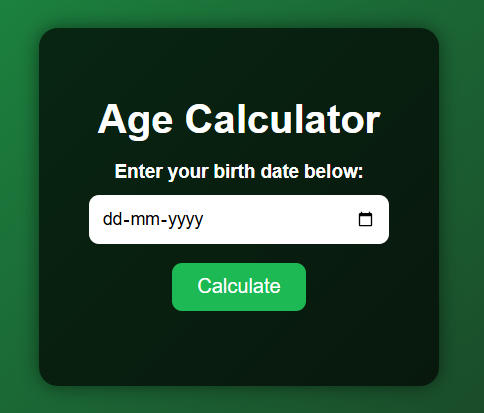

#  Age Calculator App

The Age Calculator is a simple yet useful web application built using HTML, CSS, and JavaScript that allows users to calculate their exact age in years, months, and days based on their date of birth. The user inputs their birth date, and the app instantly displays their current age by comparing it with the current date.
## 🚀 Live Demo

👉 [Live App](https://calculator-43fe.vercel.app/)

## 🛠️ Tech Stack

- **HTML5**
- **CSS3**
- **JavaScript**

## ✨ Features

- calculate their exact age in years, months, and days based on their date of birth

## 📚 Ideal For

- JavaScript Beginners
- Front-End Practice Projects
- UI/UX Improvement Exercises

## 📫 Contact Me

- **📧 Email:** sajeevtk42@gmail.com  
- **💼 LinkedIn:** [https://www.linkedin.com/in/sajeev-tk/](https://www.linkedin.com/in/sajeev-tk/)

## ⭐ Like This Project?

If you enjoyed this project or found it useful, please consider giving it a **⭐ star** on GitHub — your support is appreciated!

